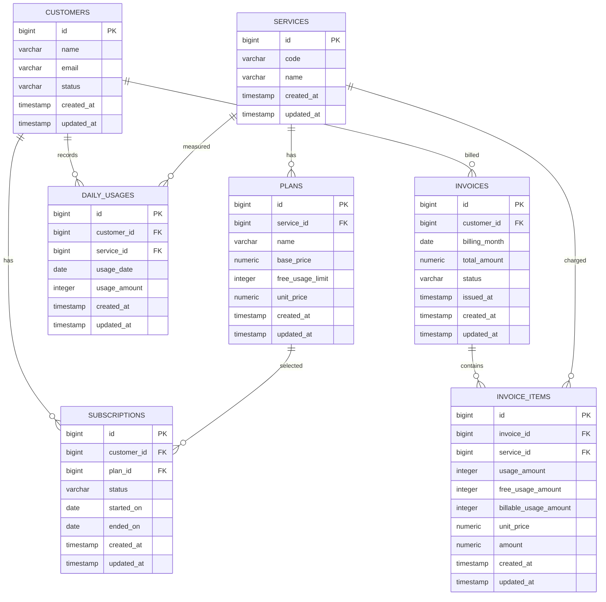

# ER図

```mermaid
erDiagram
    CUSTOMERS ||--o{ SUBSCRIPTIONS : has
    SERVICES ||--o{ PLANS : has
    PLANS ||--o{ SUBSCRIPTIONS : selected
    CUSTOMERS ||--o{ DAILY_USAGES : records
    SERVICES ||--o{ DAILY_USAGES : measured
    CUSTOMERS ||--o{ INVOICES : billed
    INVOICES ||--o{ INVOICE_ITEMS : contains
    SERVICES ||--o{ INVOICE_ITEMS : charged

    CUSTOMERS {
        bigint id PK
        varchar name
        varchar email
        varchar status
        timestamp created_at
        timestamp updated_at
    }

    SERVICES {
        bigint id PK
        varchar code
        varchar name
        timestamp created_at
        timestamp updated_at
    }

    PLANS {
        bigint id PK
        bigint service_id FK
        varchar name
        numeric base_price
        integer free_usage_limit
        numeric unit_price
        timestamp created_at
        timestamp updated_at
    }

    SUBSCRIPTIONS {
        bigint id PK
        bigint customer_id FK
        bigint plan_id FK
        varchar status
        date started_on
        date ended_on
        timestamp created_at
        timestamp updated_at
    }

    DAILY_USAGES {
        bigint id PK
        bigint customer_id FK
        bigint service_id FK
        date usage_date
        integer usage_amount
        timestamp created_at
        timestamp updated_at
    }

    INVOICES {
        bigint id PK
        bigint customer_id FK
        date billing_month
        numeric total_amount
        varchar status
        timestamp issued_at
        timestamp created_at
        timestamp updated_at
    }

    INVOICE_ITEMS {
        bigint id PK
        bigint invoice_id FK
        bigint service_id FK
        integer usage_amount
        integer free_usage_amount
        integer billable_usage_amount
        numeric unit_price
        numeric amount
        timestamp created_at
        timestamp updated_at
    }
```
